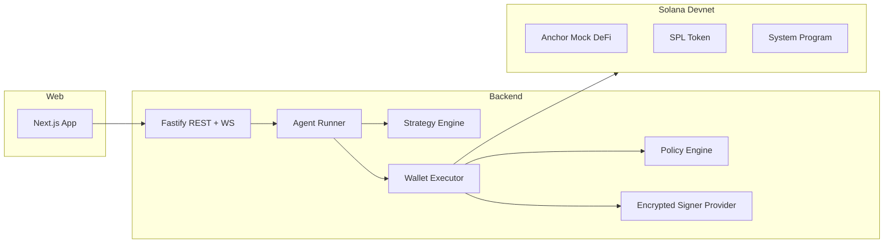

# Autarch District: Agentic Wallets for AI Agents (Solana Devnet)

Autarch District is a devnet prototype that provides autonomous wallet accounts for AI agents.  
Each agent owns its own signer, receives funds, executes policy-gated trades, and reports outcomes through a shared control plane.

## Bounty Alignment

This prototype demonstrates:

- programmatic wallet creation
- automated transaction signing (no manual wallet prompts)
- SOL and SPL token support
- interaction with a test protocol (Anchor mock DeFi program)
- multiple agents operating independently on devnet
- open-source implementation with setup and run instructions

## Core Flow

1. create agent wallet accounts
2. fund and initialize agents
3. AI strategy simulation decides trade intent
4. policy engine validates limits and allowlist
5. wallet executor simulates, signs, submits, confirms
6. dashboard shows status, signatures, and errors

## Architecture



## Prerequisites

- Node.js 20+
- corepack enabled
- pnpm 10+
- Solana CLI
- Anchor CLI
- Rust toolchain (for Anchor program build/deploy)

## Environment

Copy env file:

- `Copy-Item .env.example .env`

Set required values in `.env`:

- `KEYSTORE_MASTER_KEY` (32+ chars)
- `PROGRAM_ID` (deployed Anchor program id)
- `AGENT_STRATEGY` (`heuristic_ai` or `random`)
- `AI_MIN_CONFIDENCE` (0..1, default `0.5`)

## Solana Setup (Devnet)

```powershell
solana config set --url https://api.devnet.solana.com
solana config set --keypair C:\Users\<you>\.config\solana\id.json
solana balance
```

## Install

```powershell
corepack pnpm install
```

## Run Backend and Web

Terminal 1:

```powershell
corepack pnpm --filter backend dev
```

Terminal 2:

```powershell
corepack pnpm --filter web dev
```

Open:

- `http://localhost:3000` (landing)
- `http://localhost:3000/app` (dashboard)

## Deploy Mock Program to Devnet

```powershell
anchor build
anchor deploy --provider.cluster devnet
```

Then set deployed program id to `.env` `PROGRAM_ID`.

## API Demo Flow

### Setup

```powershell
Invoke-RestMethod -Method POST -Uri http://localhost:3001/demo/setup -ContentType "application/json" -Body "{}"
```

### Run

```powershell
Invoke-RestMethod -Method POST -Uri http://localhost:3001/demo/run -ContentType "application/json" -Body '{"rounds":3,"amount":1000}'
```

### Stop

```powershell
Invoke-RestMethod -Method POST -Uri http://localhost:3001/demo/stop -ContentType "application/json" -Body "{}"
```

## Strategy Modes

- `heuristic_ai` (default): confidence-based synthetic signal strategy
- `random`: fallback random direction/amount strategy

## Security Notes

- signer secret bytes are encrypted at rest (AES-256-GCM)
- secrets are decrypted in memory only during signing
- allowlist and spend caps are enforced before submit
- devnet-only RPC guard prevents accidental mainnet usage

## Project Structure

- `apps/backend`: API, signer/keystore, runner, policy, strategies, tests
- `apps/web`: landing + dashboard
- `programs/agent_mock_defi`: Anchor test protocol
- `SKILLS.md`: runtime instructions for autonomous agents
- `DEEP_DIVE.md`: design and security explanation

## Validation Commands

```powershell
corepack pnpm --filter backend test
corepack pnpm --filter backend build
corepack pnpm --filter web build
```
