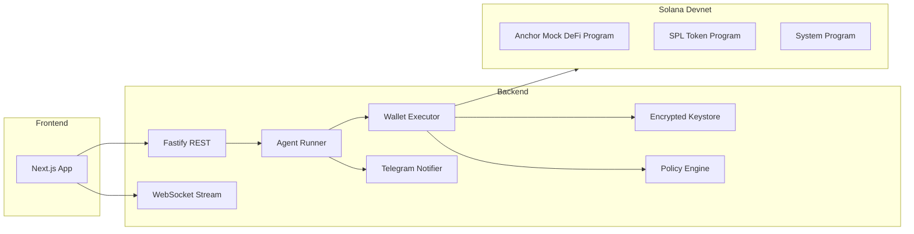

# Autarch District - Agentic Wallets for AI Agents (Solana Devnet)
[](https://github.com/Nnadijoshuac/AutarchDistrict/actions/workflows/ci.yml)

Autarch District is a prototype control plane for autonomous AI-agent wallets on Solana devnet.

It provides:
- Programmatic wallet provisioning for agents
- Automated transaction signing and execution
- Policy-gated, devnet-only transaction controls
- SPL token setup and swaps against a mock Anchor DeFi program
- Monitoring via dashboard, API, WebSocket stream, and Telegram notifications

## Live Deployment

- Frontend: `https://autarchdistrict.vercel.app`
- Backend API: `https://autarchdistrict.onrender.com`
- Health check: `https://autarchdistrict.onrender.com/health`

## Quick Demo Flow (For Judges)

1. Open the frontend and go to `/app`.
2. Click `Create Agents` to provision wallets.
3. Click `Fund/Setup Demo` to mint tokens, seed balances, and initialize pool state.
4. Click `Run Demo` to execute autonomous swaps.
5. Review:
   - Agent state updates
   - Transaction log entries
   - Optional Telegram alerts
6. Click `Stop Demo`.

## Requirement Mapping (Hackathon)

1. Create wallet programmatically: `apps/backend/src/keystore/keystore.ts`
2. Sign automatically: `apps/backend/src/wallet/txBuilder.ts`
3. Hold SOL/SPL: `apps/backend/src/routes/demo.ts`
4. Interact with test protocol: `apps/backend/src/protocol/mockDefiClient.ts` + `programs/agent_mock_defi`
5. Deep dive: `DEEP_DIVE.md`
6. Open-source with setup docs: this `README.md`
7. `SKILLS.md` included for agents
8. Devnet-only enforcement: `apps/backend/src/config.ts`

## Architecture



## Local Development

### Prerequisites

- Node.js 20+
- pnpm 10+
- Solana CLI
- Anchor CLI
- Rust toolchain

### Setup

1. Install dependencies:
```bash
corepack pnpm install
```
2. Copy env:
```bash
cp .env.example .env
cp apps/web/.env.example apps/web/.env.local
```
3. Set required secrets in `.env`:
   - `KEYSTORE_MASTER_KEY`
   - `PROGRAM_ID`
4. Ensure Solana devnet:
```bash
solana config set --url https://api.devnet.solana.com
```
5. Build and deploy Anchor program (devnet):
```bash
pnpm anchor:build
pnpm anchor:deploy:devnet
```
6. Run app:
```bash
pnpm dev
```

Backend: `http://localhost:3001`  
Frontend: `http://localhost:3000`

## API Endpoints

- `GET /health`
- `GET /agents`
- `POST /agents`
- `POST /demo/setup`
- `POST /demo/run`
- `POST /demo/stop`

## Environment Variables

See `.env.example`. Key fields:
- `SOLANA_RPC_URL`, `SOLANA_WS_URL` (devnet)
- `KEYSTORE_MASTER_KEY`
- `PROGRAM_ID`
- `DATA_DIR` (persistent directory on cloud)
- `WEB_ORIGIN`
- `TELEGRAM_*` (optional alerts)

## Cloud Deployment Notes

### Backend (Render)

- Use a persistent disk and set:
  - `DATA_DIR=/var/data/autarch-data`
- Set `SOLANA_KEYPAIR_PATH` to mounted secret file path for funded signer.
- Keep devnet RPC and program id configured.

### Frontend (Vercel)

Frontend uses a Next.js proxy route (`/api/backend/[...path]`) to forward API requests to backend, reducing browser CORS issues.

## Security Notes

- Secrets are never hardcoded in source.
- Keystore stores encrypted secret keys (AES-256-GCM) at rest.
- Policy layer enforces program allowlist and spend controls.
- Devnet-only guard blocks non-devnet RPC usage.

## Repository Layout

- `apps/backend`: API, wallet engine, keystore, policies, agent runner
- `apps/web`: landing page + dashboard UI
- `programs/agent_mock_defi`: Anchor mock DeFi program
- `DEEP_DIVE.md`: design and security deep dive
- `SKILLS.md`: runtime guidance for agents
